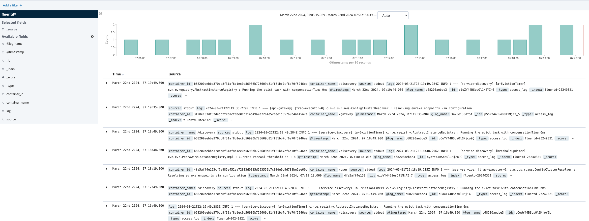
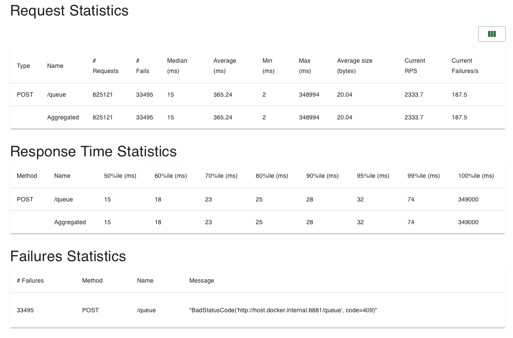

# 🌽 conting : 블록체인 기반 암표 없는 티켓팅 서비스


## conting 다운로드 링크 : [링크](https://drive.google.com/drive/folders/1ud2vBA_2aQ78XyVMgRrrOxeCU5iIGGnG?usp=sharing)

## 소개 영상 


## 🌽 프로젝트 진행기간
2024.02.22(목) ~ 2024.04.04(목) (총 42일) <br>
SSAFY 10기 광주 2반 특화 PJT
</br>

## 🌽 conting - 기획 배경


## 🌽 주요 기능

---

📢 “NFT 기반 암표 방지 및 응모권 거래 서비스”

1️⃣ NFT 기반 토큰 발급으로 암표 거래 방지

2️⃣ 생체인증기반 qr 코드 입장권 생성으로 입장 및 티켓 관리를 간편화

3️⃣ 3D 티켓북 및 포토티켓 커스텀

4️⃣ DID 기반 가족 양도 시스템

5️⃣ 사용한 티켓을 응모권으로 굿즈 응모 기능 및 NFT 기반 응모권 거래 시스템

---

## 사용 기술

---

#### FE
- React Native, biometric, fcm, fastlane, 3js, realm
#### BE
- Spring Boot/Cloud/Security/Batch, Node.js JWT, Redis Cluster, MariaDB, Kafka, Web Flux, JPA, R2DBC
#### INFRA
- AWS EC2, Jenkins, Nginx, S3,  fluentd, elastic search
#### BC
- NFT. DID, Solana, Web3
#### ETC
- FFMPEG(영상 정보 추출용도),

---

## 기술 특이점

---

1. 대규모 트래픽에 대응한 티케팅 시스템
- 레디스 활용 대기큐 구현 및 가용성을 위한 레디스 클러스터 구축
- 카프카 활용 microservice간 이벤트 드리븐 시스템 구현

2. NFT를 활용한 티켓 발급 및 티켓 검표
- NFT 활용 티켓 검표 및 클라이언트 qr 캡처 방지 기능과 네트워크를 끄고 캡쳐를 진행하는 경우를 방지하기 위한 레디스를 활용한 네트워크 차단감지
- 환불표 발생시, 기존 대기 인원에게 구매 기회를 양도하므로서 판치기 기법 방지

3. DID활용하여 가족관계 등록 및 가족간 티켓 양도기능

4. nft활용 사용된 티켓을 포토카드 및 굿즈 응모권으로 사용 및 거래가능

---

## 프로젝트 특장점

---
### 기획 차별점

1. 예매전 공연장 좌석 3d 뷰 및 지도 제공기능

2. nft와 클라이언트, 서버 로직을 활용한 활용한 암표방지
- qr코드 캡처 방지를 활용한 qr 코드 거래 방지
- 네트워크를 끄고 qr코드를 캡쳐할 경우를 방지하기 위한 네트워크 차단 감지 후 qr 무효화 기능
- 지문인식으로 비대칭키를 생성하여 기반 티켓 접근 권한 부여

3. NFT 티켓 사용 후 응모권 활용 및 움직이는 포토카드 구현
- 스프링 배치 활용 영상을 webm로 변환하는 로직
- 이벤트 응모권으로 굿즈 응모 및 응모권 거래 기능

### 기술 차별정

1. 대기큐와 좌석 조회 API를 webflux 기반의 비동기로 구현하여, 대규모 트래픽이 발생하더라도 고가용성을 확보함

2. 레디스 클러스터와 aof 기능을 활용하여 대기큐의 백업 및 가용성을 확보

3. ffmpeg를 사용하여 영상을 크롤링 해와 webm 형식의 움직이는 이미지로 변경

4. 클라이언트와 연동되는 지문인식 기반 비대칭키를 활용하여 티켓 접근 권한 부여
---


### 스플래시 뷰
- [해당 화면 FE 코드 보기](/app/frontend/src/screens/authScreen/SplashScreen.tsx)

  


```
스플레쉬 화면에서 서버에 모든 콘서트 정보를 요청합니다. 
해당 요청이 완료가 된경우 앱 내 저장소에 저장 후 로그인 페이지로 이동합니다.
요청이 실패한 경우는 앱을 재 구동해달라는 메세지를 보냅니다.
```


### 로그인
- [해당 화면 FE 코드 보기](/app/frontend/src/screens/authScreen/LoginScreen.tsx)
- [해당 화면 BE 코드 보기](https://lab.ssafy.com/s10-blockchain-contract-sub2/S10P22C209/-/blob/main/server/user/src/main/java/com/c209/user/domain/auth/controller/AuthController.java?ref_type=heads)

  


```
[작업 내용]
이메일 형식을 검증합니다. 올바른 이메일 형식이 아니라면 올바른 이메일 형식을
알려주는 메세지를 보여줍니다.
비밀번호 패턴 검증을 합니다. 올바른 비밀번호 패턴이 아니라면 로그인 버튼이
활성화 되지 않습니다.
서버에 로그인 요청을 보낸 후 성공한다면 JWT 토큰을 전역으로 상태관리하여 
인스턴스 함수에서 사용되게 하여 프론트서버에서 보내게 되는 API는 토큰을 
넣거나, 재발행 같은 예외처리를 자동화하여 프론트 팀에서 작업하게 해야하는 
불편함을 해소했습니다.
```

### 메인화면
- [해당 화면 FE 코드 보기](/app/frontend/src/screens/mainScreen/MainScreen.tsx)
- [해당 화면 BE 코드 보기](https://lab.ssafy.com/s10-blockchain-contract-sub2/S10P22C209/-/tree/main/server/catalog/src/main/java/com/c209/catalog/domain?ref_type=heads)
  


```
[작업 내용]
메인 포스터 전체 이미지 색에 따라 배경이 동적으로 변화합니다. 
```


- 선착순 공연
    


```
[작업 내용]
예매 방식이 선착순 예매인 공연을 횡스크롤로 확인할 수 있습니다. 
```
    


- 추첨 공연

  
    
```
[작업 내용]
예매 방식이 추첨 예매인 공연을 횡스크롤로 확인할 수 있습니다. 
```
    


- 광고 배너 및 응모 이벤트 리스트
    
    

```
[작업 내용]
NFT 응모권을 활용한 응모 굿즈를 확인할 수 있습니다. 
```
    


### 공연 상세 페이지에서 토글이 될 예매부탁/직접예매 버튼
- [해당 화면 FE 코드 보기](/app/frontend/src/screens/settingScreen/MyPageScreen.tsx)


```
[작업내용]
가족에게 티켓 구매 권한을 넘기는 UI 및 직접 구매를 하는 버튼 UI를 구현했습니다. 
```

### 예매할 경우 대기열 입장
- [해당 화면 FE 코드 보기](/app/frontend/src/screens/mainScreen/ticketingScreen/WaitingScreen.tsx)
- [해당 화면 BE 코드 보기](https://lab.ssafy.com/s10-blockchain-contract-sub2/S10P22C209/-/tree/main/server/queue?ref_type=heads)


```
[작업내용]
대용량 트래픽을 처리하기 위한 대기열을 구성했습니다.
```

### 구역 선택
- [해당 화면 FE 코드 보기](/app/frontend/src/screens/mainScreen/ticketingScreen/SeatingAreaSelectScreen.tsx)


```
[작업내용]
전체 구역을 다 보여준다면, 자리 선택하는 UI가 너무 작아지기 때문에
구역을 탭으로 나누어 선택할 수 있는 UI를 구현했습니다. 
```

### 좌석 선택
- [해당 화면 FE 코드 보기](/app/frontend/src/components/seat)


```
좌석 이미지의 좌석 좌표를 찾은 뒤 해당 좌석을 터치로 접근할 수 있게 하는 UI를 구성했습니다. 
```

### 결제 정보 및 결제 결과
- [해당 화면 FE 코드 보기](/app/frontend/src/screens/mainScreen/ticketingScreen/PaymentScreen.tsx)

- 결제 성공 시


    


- 응모 성공 시


    


- 결제 실패 시


```
[작업내용]
결제,응모 결과에 따른 UI를 구현했습니다.
```

### 입장권
- [해당 화면 FE 코드 보기](/app/frontend/src/screens/ticketEntryScreen/TicketListScreen.tsx)


### 구매 내역
- [해당 화면 FE 코드 보기](/app/frontend/src/screens/ticketEntryScreen/ticketRefundScreen/RefundInfoScreen.tsx)


```
[작업내용]
콘서트 NFT 티켓 입장권을 UI를 구성했습니다.
```


### 환불
- [해당 화면 FE 코드 보기](/app/frontend/src/screens/mainScreen/ticketingScreen/ResultRefundScreen.tsx)

- 성공 시


- 실패 시


    

```
[작업내용]
환불 결과에 따른 UI를 구현했습니다.
```


### 그 외 작업중인 추첨결과 및 티켓북 탭 화면
- [해당 화면 FE 코드 보기](/app/frontend/src/screens/lotteryResultScreen/ReservationWaitingScreen.tsx)
- [해당 화면 FE 코드 보기](/app/frontend/src/screens/ticketApplyScreen/NftTicketListScreen.tsx)


# 인프라

## 중앙 로그 관리소
- [키바나 링크](http://j10c209.p.ssafy.io:5601/)
- 비밀번호는 임시로 풀어놓았습니다. 
```
[작업 내용]
Elastic Search, Fluent D, Kibana를 활용해 기동중인 모든 도커 컨테이너의 로그를 수집하여 한 곳에서 관리합니다. 
```



## 젠킨스와 도커 컨테이너 기반 CI/CD 환경 구축
- [젠킨스 링크](http://3.39.248.185:8080/login?from=%2F)
- ssh private key등 예민한 정보를 내부에서 다루고 있어서 계정 로그인을 설정해놓았습니다. 
```
[작업 내용] 
도커 컨테이너와 EC2, Jenkins를 활용해 모노레포에서의 MSA CI/CD 환경을 구축하였습니다. 
```

## locust를 활용해 대기큐 성능 측정 중
- [테스트 및 환경설정 코드 보기](https://lab.ssafy.com/s10-blockchain-contract-sub2/S10P22C209/-/tree/main/server/queue/load-test?ref_type=heads)

```
[작업 내용]
web flux와 단일 Redis를 활용해 완전 비동기 방식으로 
대기큐 진입 및 대기큐 조회, 대기큐 제거 API를 개발하였습니다. 
locust를 이용해 사용자 수 10만명 ramp up time 10초로 초당 1만명이 몰려드는 상황으로
peek test를 진행하고 성능 개선 방안을 고민중입니다. 

동일 호스트 내부에서 테스트를 진행해서 정확하지 않은 상태라, 추후 배포 후 다시 실험해볼 생각입니다.
 
```




```
[작업내용]
현재 결과에서는 약 82만의 리퀘스트에 대해 3만 정도의 에러가 발생했습니다. 
하지만 33,495건의 에러는 전부 유저가 동일 큐에 대해 진입 요청을 하는 409 (Conflict)에러 상황이므로 
connection out에 따른 서버 에러는 없는 상태입니다. 

```


```
[작업내용]
대부분 
0.2초에서 4초 사이의 응답을 받지만, 
일부 유저들의 경우 대기시간이 6초를 넘어가기 때문에 이를 해결해야할 것 같습니다
```


# 블록체인
블록 체인은 다음 기능을 구현하였습니다. 
1. 나의 NFT 티켓 판매 조회
2. 나의 NFT 티켓 조회 
3. NFT 티켓 응모권 구매 
4. NFT 티켓 판매 
- [다음 링크에서 확인 가능합니다.](https://lab.ssafy.com/s10-blockchain-contract-sub2/S10P22C209/-/tree/main/server/blockchain-service?ref_type=heads)
